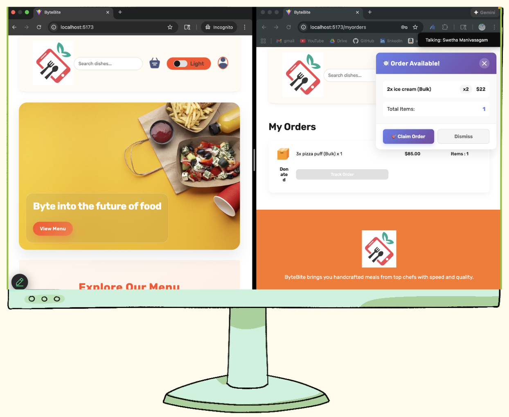
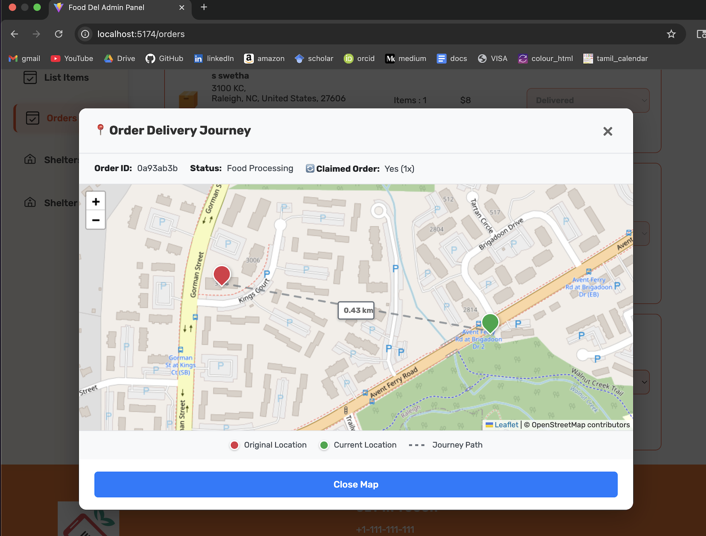

# ByteBite 🍴
## Re-imagining food delivery with purpose!

With ByteBite, a cancelled meal doesn’t end up in the trash — it becomes a discounted opportunity for another customer or a warm donation for a nearby shelter. Enjoy a richer ordering experience with live notifications, instant claiming and beautiful 3D dish previews! It’s a food delivery app that loves the planet back.

[](https://doi.org/10.5281/zenodo.17547336)

## Project Health & Status

[](https://github.com/Shorse321/CSC510Group24/actions/workflows/backend.yml)
[](https://github.com/Shorse321/CSC510Group24/actions/workflows/frontend.yml)
[](https://github.com/Shorse321/CSC510Group24/actions/workflows/admin.yml)

[](https://codecov.io/gh/Shorse321/CSC510Group24)

---

### Repository Stats

[](LICENSE)
[](https://github.com/Shorse321/CSC510Group24/graphs/contributors)
[](https://github.com/Shorse321/CSC510Group24/commits/main)
[](https://github.com/Shorse321/CSC510Group24/issues)

---

### Built With


---

**Demo video available on Google Drive:** [Click here to access](https://drive.google.com/file/d/1ws95d9AsfzAQjkV7fxJZKcYslp2gvSQT/view?usp=sharing)

---
## Key Features & Improvements 🍴



- **Cancel-to-Redistribute 🔄**  
  Converts canceled orders into **real-time redistributable offers** that users can claim instantly.

- **Shelter Distribution Pipeline 🏠**  
  Connects surplus food with **partner shelters and NGOs**, minimizing waste and maximizing community impact.

- **3D Visualization 🎨🖼️**  
  Provides **interactive 3D previews** of meals, giving users a realistic and engaging menu experience.

- **Admin Dashboard 📊🛠️**  
  Centralizes management for **menu, orders and shelter redistribution**, making operations efficient and seamless.

- **Smart Customer Matching 📍**  
  Uses **location-based notifications** so only nearby and relevant users are alerted to canceled meals.  
  Includes **smart map previews** to visualize the journey of redistributed orders.




- **Personalized Recommendation Engine 🤖💡**  
  Suggests dishes based on **past orders and nutritional preferences**, boosting engagement with tailored meal recommendations.

- **Basic Preference Filters 🎯**  
  Allows customers to tag **food preferences, notifications and budget**, ensuring recommendations remain meaningful and targeted.

- **Restaurant Surplus Quick List 🏪⚡**  
  Enables restaurants to **bulk-list extra items at discounted rates**, expanding reuse opportunities beyond cancellations.
---

## System Overview

### Backend (`backend/`)

- Node.js + Express + MongoDB API  
- Provides authentication, menu, cart, order, shelter, and reroute endpoints  
- JWT-based authenticated operations

### Frontend (`frontend/`)

- React + Vite customer-facing application  
- Browse menu, place orders, claim redistributed orders, view 3D models

### Admin (`admin/`)

- React + Vite restaurant admin dashboard  
- Manage menu items, monitor orders, update statuses, assign orders to shelters

---

## Core Functionalities

### 1. Customer Ordering

- Registration and login  
- Menu browsing, cart management, order placement  
- Orders stored in MongoDB with finite-state statuses:
  - `Food Processing`  
  - `Out for delivery`  
  - `Delivered`  
  - `Redistribute`  
  - `Cancelled`  
  - `Claimed`  
- Payment via Stripe or cash-on-delivery

### 2. Cancellation and Redistribution Queue

- Orders can be cancelled if status permits  
- Cancelled orders enter `Redistribute` queue  
- Real-time notifications sent via Socket.IO

### 3. Restaurant-to-Shelter Donation

- Assign cancelled/redistributed orders to partner shelters  
- Shelter metadata stored in `reroutes` collection  
- `/api/reroutes` supports paginated access for admin dashboard

### 4. 3D Menu Visualization

- Optional 3D model uploads for menu items  
- Rendered using `three`, `@react-three/fiber`, and `@react-three/drei`  
- Interactive 3D carousel enhances user experience

### 5. Claiming Cancelled Orders

- Redistributable orders claimable by other customers  
- Ownership and status updated upon claim  
- Shelters are assigned by restaurant staff only
- Claim notifications sent based on proximity preferences of users
- Maps to visualise order location, journey and shelters

### 6. Bulk Surplus Sales

- Create bulk items with quantity, discounted price, availability  
- Appears in dedicated "Surplus/Bulk" section on frontend

### 7. User Notification Preferences

- Users set preferences for:
  - Distance filters  
  - Enable/disable notifications  
  - Price range  
  - Specific items  

### 8. Personalized Rule-Based Meal Recommendations

- Taste profile based on past orders, preferences, menu tags  
- Scores dishes using deterministic rules:
  - Preference and category matching  
  - Price comfort range  
  - Frequently ordered item similarity  
  - Highlights good surplus/value deals  
- Cold-start recommendations available for new users  
- Ranked list with rationale shown on Cart/Menu pages

---

## Project Stats

- **Partner Shelters/NGOs:** 10  
- **Active Contributors:** 4 (core developers from Team G24)  
- **Intelligent Modules:** 4 (Cancel-to-Redistribute, Shelter Pipeline, Real-time Claim Notifications, 3D Visualization)

> _ByteBite transforms cancelled and surplus orders into redistributable meals — connecting restaurants, users, and shelters in real time to reduce food waste and support the community._
## Repository Structure

```proj3/SE_G25-main/
├── .github/
│   └── workflows/
├── docs/
├── proj1/
├── proj2/
├── admin/
├── frontend/
│   ├── public/
│   └── src/
│       ├── Context/
│       ├── __tests__/
│       ├── assets/
│       ├── components/
│       │   ├── AppDownload/
│       │   ├── ExploreMenu/
│       │   ├── Food3DViewer/
│       │   ├── FoodDisplay/
│       │   ├── FoodItem/
│       │   ├── Footer/
│       │   ├── Header/
│       │   ├── LoginPopup/
│       │   ├── Navbar/
│       │   └── NotificationListener/
│       └── pages/
│           ├── Cart/
│           ├── Home/
│           ├── MyOrders/
│           ├── PlaceOrder/
│           ├── Preferences/
│           └── Verify/
├── backend/
│   ├── __tests__/
│   ├── config/
│   ├── controllers/
│   │   ├── cartController.js
│   │   ├── foodController.js
│   │   ├── orderController.js
│   │   ├── recommendationController.js
│   │   ├── rerouteController.js
│   │   ├── shelterController.js
│   │   └── userController.js
│   ├── middleware/
│   ├── models/
│   │   ├── foodModel.js
│   │   ├── orderModel.js
│   │   ├── rerouteModel.js
│   │   ├── shelterModel.js
│   │   └── userModel.js
│   ├── routes/
│   │   ├── cartRoute.js
│   │   ├── foodRoute.js
│   │   ├── orderRoute.js
│   │   ├── recommendationRoute.js
│   │   ├── rerouteRoute.js
│   │   ├── shelterRoute.js
│   │   └── userRoute.js
│   ├── services/
│   ├── uploads/
│   ├── utils/
│   ├── jest.bulk.config.mjs
│   ├── jest.setup.mjs
│   ├── package.json
│   ├── package-lock.json
│   ├── server.js
│   └── test_log.txt
├── scripts/
├── .eslintrc.cjs
├── .gitignore
├── .prettierignore
├── .prettierrc.json
├── API.md
├── CHANGELOG.md
├── CODE_OF_CONDUCT.md
├── CONTRIBUTING.md
├── ENV_TEMPLATE.md
├── GETTING_STARTED.md
├── LICENSE.md
├── README.md
├── docs-config.json
├── package.json
├── package-lock.json
└── run-all-tests.sh
```
## Running the Distributable Builds (Frontend / Admin / Backend)

Step 1:
- Download and Extract the Artifacts
- Open the latest successful workflow run on main or dev.
- Scroll to Artifacts and download the build ZIPs.
- Extract them locally, for example:

```bash
   /ByteBite/builds/frontend/
   /ByteBite/builds/admin/
```
Each folder will contain a dist/ directory with production-ready static files built using npm run build.

Step 2: 
- Start the Backend Server
- The backend must be running so that the frontend and admin dashboards can communicate with it.

```bash
   cd proj2/backend
   npm install
   npm run server
```

By default, the backend API starts on http://localhost:4000

Step 3: 
- Serve the Frontend or Admin Build
- You can run the static builds using either Node’s HTTP server or Vite’s preview mode.

Option A – Using http-server (recommended for distributables)
```bash
   cd /path/to/frontend/dist
   npx http-server -p 5173

   cd /path/to/admin/dist
   npx http-server -p 5174
```

Install once if you don’t already have it:

```bash
npm install -g http-server
```

Now visit:
Frontend: http://localhost:5173
Admin: http://localhost:5174

Option B – Using Vite Preview (for Vite projects)
```bash
cd proj2/frontend
npm run preview
```
This serves the optimized build on http://localhost:4173

Step 4: 
- Verify Backend and Frontend Connection
- Make sure your backend allows requests from your local frontend/admin builds.

In your backend’s configuration: origin: process.env.FRONTEND_URL || "http://localhost:5173",

If you’re previewing both frontend (5173) and admin (5174), include both origins in your CORS settings.


## Open Communications Protocols

**StackShack** communicates using **open and standard web protocols**:

- The application runs on **HTTP/HTTPS** using REST-style Flask routes.
- All client–server interactions use **JSON** as the data-interchange format.
- The API endpoints can be accessed by any system that supports standard HTTP requests.

## Cross-platform support Check

Tested on macOS, Windows and Linux laptops using Python 3.8+.

---

## Accessibility Standards

- The user interface is designed following **WCAG 2.1** and **ARIA8** best practices wherever possible.  
- All buttons, input fields and navigation elements are keyboard-accessible.  
- Color choices maintain strong contrast for readability.  
- Semantic HTML tags (`<header>`, `<nav>`, `<main>`, `<footer>`) are used to improve screen-reader compatibility.  
- Dynamic content (like modals and alerts) is handled with proper ARIA labels and roles.

---

## Documentation Accessibility

- All documentation, including the `README.md` and `docs/` pages, follows **plain language** principles and is compatible with **Markdown renderers** that support screen readers.  
- Headings (`#`, `##`, `###`) are structured hierarchically for screen-reader navigation.  
- Text alternatives (`alt` attributes) are provided for all embedded images (e.g., logos, architecture diagrams).  
- Hyperlinks use descriptive text rather than generic labels like “click here”.

---

## Security Notes

- Never commit `.env` file to Git
- Use strong passwords in production
- Keep dependencies up to date

---

## Support

For issues or questions:
1. Check the [Troubleshooting](#troubleshooting) section
2. Contact team members for queries/help @ https://discord.gg/R9bttnvf
3. Check the [GitHub Issues](https://github.com/Shorse321/CSC510Group24/issues)

---

## Team

**Group 24**
- Adam Myers
- Akash R
- Sailesh Sridhar
- Swetha Manivasagam

Project maintained by 4 contributors; pull requests reviewed by maintainers. Contributors retain rights to their code contributions.
No funding was received for driving this project to completion.
**Course:** 

CSC 510 - Software Engineering

All team members have the following roles and responsibilities
| **Role** | **Responsibility** |
|-----------|--------------------|
| **Project Maintainers** | Oversee code quality, merge pull requests and manage releases |
| **Core Developers** | Implement new features, conduct testing and manage database schemas |
| **Contributors** | Report issues, submit pull requests (PRs) and improve documentation |
| **Reviewers** | Conduct peer reviews and ensure adherence to code conventions |

---
